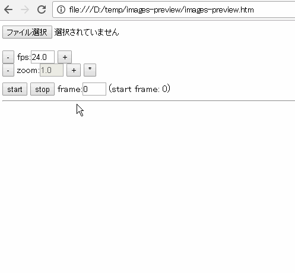
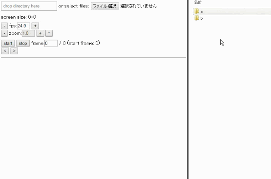

# Image-Sequence-Animation-Preview
simple HTML5 app - animate image sequence

[GitHub](https://github.com/a-nakanosora/Image-Sequence-Animation-Preview)

[Online Demo](https://a-nakanosora.github.io/Image-Sequence-Animation-Preview/images-preview.htm)

---

連番画像を一連のアニメーションとして再生します。  
ブラウザ上で動作します。(Chrome v56, Firefox v52にて動作確認)  

## 使い方

1. [Online Demo](https://a-nakanosora.github.io/Image-Sequence-Animation-Preview/images-preview.htm) を開く、もしくは`images-preview.htm`を適当な場所にダウンロード、ブラウザで開く
2. `ファイルを選択`ボタンを押しファイル選択ダイアログを表示、対象となる連番画像(複数)を選択
3. 選択した画像がアニメーションとして再生されます

---

* `fps`, `zoom`を両隣のボタンから変更可能
* `frame`に値を入力することでそのフレームから再生を始めることができます
* 対象となる画像のファイル名は末尾に数字が付いていれば他は任意です

### ディレクトリから再生

v0.4から連番画像を含むディレクトリのドラッグ＆ドロップに対応しました。しかし使用にあたっていくつかの制約があります：
* ブラウザは Chrome のみ対応
* ローカルに保存してからHTMLファイルを開いた場合には動作しない (URLが`file://~~~`のケース)。これはブラウザの仕様による制約となってます。
  [Online Demo](https://a-nakanosora.github.io/Image-Sequence-Animation-Preview/images-preview.htm) を使うか、ローカルサーバ上で動かす必要があります。

## 注意点

:exclamation: 今のところかなりメモリ効率が悪いため、巨大な画像を数百枚開くとメモリ使用量をかなり圧迫する可能性があります。

